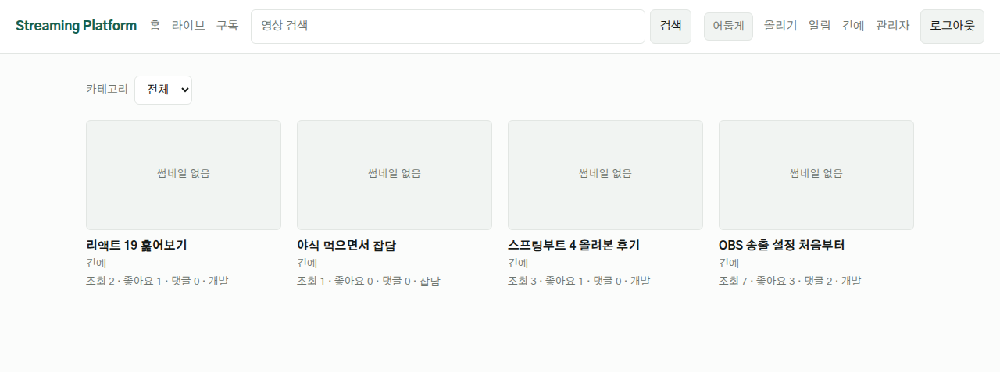
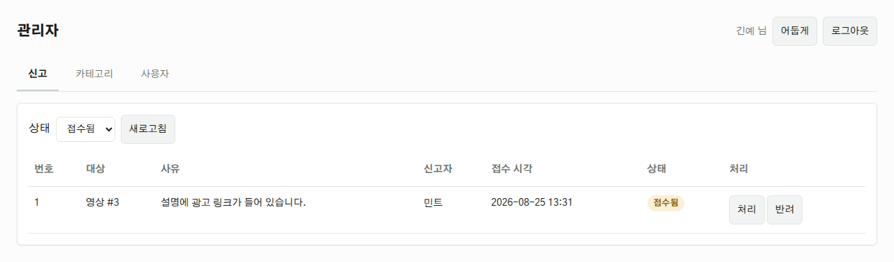
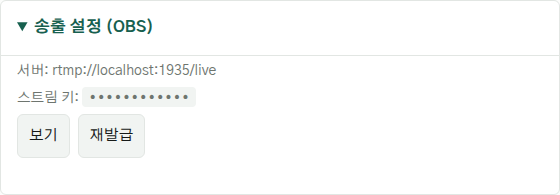
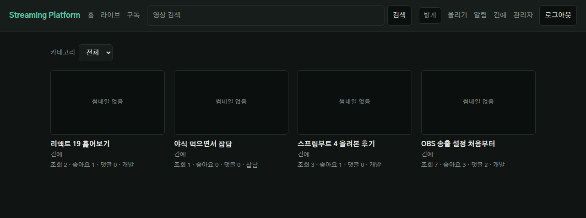

# Streaming Platform

실시간 스트리밍 플랫폼 개인 프로젝트입니다.

## 기술 스택

| 영역 | 사용 기술 |
|---|---|
| Backend | Java 21, Spring Boot 4, Spring Security, Spring Data JPA, JWT |
| Frontend | React 19, Vite, hls.js |
| Database | MySQL 8 |
| Streaming | nginx-rtmp (RTMP 수신 → HLS 변환) |

## 프로젝트 구조

```
api/         Spring Boot 백엔드
web/         React 프론트엔드
streaming/   nginx-rtmp 도커 구성
docs/        요구사항 · ERD · API 명세 · 컨벤션
```

> 처음 켜신다면 [집에서 확인할 것](#집에서-확인할-것) 을 순서대로 따라가시면 됩니다.

---

## 사전 준비

- JDK 21
- Node.js 20 이상
- Docker Desktop
- Git

> **Windows 사용자**: 아래 명령은 **CMD 기준**입니다.
> PowerShell 이라면 `gradlew.bat` 앞에 `.\` 를 붙이세요 (`.\gradlew.bat`).
> Git Bash 를 쓴다면 macOS/Linux 명령을 그대로 쓰면 됩니다 (`./gradlew`).

---

## 내려받기

```bash
git clone https://github.com/ginye28/streaming-platform.git
cd streaming-platform
```

이미 받아 뒀다면 그 폴더로 이동하면 됩니다.
**`api` 폴더가 보이는 위치**에서 아래 명령들을 실행하세요.

작업 브랜치로 이동합니다. `git fetch` 를 먼저 해야 로컬이 브랜치를 인식합니다.

```bash
git fetch origin
git checkout claude/code-review-26k8iw
```

> `error: pathspec ... did not match any file(s) known to git` 가 뜨면
> `git fetch origin` 을 빠뜨린 것입니다. 그래도 안 되면 아래처럼 명시적으로:
> ```bash
> git checkout -b claude/code-review-26k8iw origin/claude/code-review-26k8iw
> ```

---

## 실행하기

DB 를 어떻게 준비하느냐에 따라 세 가지 방법이 있습니다. **A 가 가장 간단합니다.**

| 방법 | 필요한 것 | 설정 파일 |
|---|---|---|
| A. H2 | 없음 | 필요 없음 |
| B. Docker MySQL | Docker | 필요 없음 |
| C. 직접 설치한 MySQL | MySQL | 2개 만들어야 함 |

### A. DB 없이 바로 켜기

MySQL 없이 H2(파일 기반)로 돕니다. 처음이거나 OBS 만 확인할 때 권장합니다.

**Windows (CMD)**
```bat
cd api
gradlew.bat bootRun --args="--spring.profiles.active=local"
```

**macOS / Linux / Git Bash**
```bash
cd api
./gradlew bootRun --args='--spring.profiles.active=local'
```

- 데이터는 `api/data/` 에 저장되어 서버를 껐다 켜도 남습니다.
- 데이터를 눈으로 보려면: http://localhost:8080/h2-console
  (JDBC URL `jdbc:h2:file:./data/streaming`, 사용자 `sa`, 비밀번호 없음)
- 처음부터 다시 시작하려면 `api/data/` 폴더를 지우면 됩니다.

### B. Docker 로 MySQL 띄우기

프로젝트 루트에서 MySQL 컨테이너를 띄웁니다. DB 를 직접 설치하지 않아도 됩니다.

```bash
docker compose up -d mysql
```

`healthy` 가 될 때까지 기다린 뒤(처음엔 30초쯤 걸립니다) 실행합니다.

```bash
docker compose ps          # STATUS 가 healthy 인지 확인
```

**Windows (CMD)**
```bat
cd api
gradlew.bat bootRun --args="--spring.profiles.active=mysql"
```

**macOS / Linux / Git Bash**
```bash
cd api
./gradlew bootRun --args='--spring.profiles.active=mysql'
```

접속 정보 (컨테이너 기본값, `docker-compose.yml` 에 정의):

| 항목 | 값 |
|---|---|
| host / port | `localhost:3306` |
| database | `streaming` |
| user / password | `streaming` / `streaming` |
| root password | `root` |

- DB 데이터는 도커 볼륨에 남습니다. `docker compose down` 해도 유지됩니다.
- 완전히 초기화하려면 `docker compose down -v`

### C. 직접 설치한 MySQL 로 실행

**1. 데이터베이스 생성**

```sql
CREATE DATABASE streaming
  DEFAULT CHARACTER SET utf8mb4
  DEFAULT COLLATE utf8mb4_unicode_ci;
```

**2. 로컬 설정 파일 만들기**

두 파일은 `.gitignore` 처리되어 있어 직접 만들어야 합니다.

```bash
cd api/src/main/resources
cp application-secret.yaml.example application-secret.yaml
cp application-db.yaml.example    application-db.yaml
```

- `application-secret.yaml` → `jwt.secret` 은 **최소 32바이트**여야 합니다.
  짧으면 애플리케이션이 기동되지 않습니다.
- `application-db.yaml` → DB 계정과 비밀번호

**3. 실행** — 프로필 없이 그냥 실행합니다.

```bash
cd api
./gradlew bootRun
```

> A · B 프로필의 JWT 시크릿은 개발 전용 고정값입니다. 배포에는 쓰지 마세요.

### 공통

실행 후:

- API: http://localhost:8080
- Swagger: http://localhost:8080/swagger

**프론트엔드**

```bash
cd web
cp .env.example .env   # 최초 1회 (Windows CMD: copy .env.example .env)
npm install            # 최초 1회
npm run dev
```

http://localhost:5173

**스트리밍 서버** — 프로젝트 루트에서 실행합니다.

```bash
docker compose up -d streaming
```

- RTMP 수신: `rtmp://localhost:1935/live`
- HLS 재생: 백엔드가 알려주는 `hlsUrl`
- 상태 확인: `curl http://localhost:8081/health`

> 스트리밍 서버는 송출 시작 시 백엔드(`8080`)로 스트림 키 검증 요청을 보냅니다.
> **백엔드가 떠 있지 않으면 송출이 거부됩니다.**

MySQL 과 스트리밍 서버를 한 번에 띄우려면:

```bash
docker compose up -d
```

---

## OBS로 방송 송출하기

백엔드와 스트리밍 서버를 켠 뒤, 아래 스크립트를 실행하면 계정 준비부터
결과 확인까지 알아서 해 줍니다. **프로젝트 루트에서** 실행하세요.

**Windows (PowerShell)**
```powershell
powershell -ExecutionPolicy Bypass -File scripts\verify-live.ps1
```

**macOS / Linux / Git Bash**
```bash
./scripts/verify-live.sh
```

스크립트가 OBS 에 넣을 값을 알려주고, [방송 시작] 을 누르면
방송이 잡히는지 · 재생 URL 이 만들어지는지 · 스트림 키가 노출되지 않는지까지 확인합니다.

**직접 해보려면**

1. 회원가입 후 로그인해 토큰을 받습니다.
2. `GET /api/users/stream-key` 로 본인의 스트림 키를 조회합니다.
3. OBS → 설정 → 방송
   - 서비스: **사용자 지정...**
   - 서버: `rtmp://localhost:1935/live`
   - 스트림 키: 2번에서 받은 값
4. 방송 시작 후 `GET /api/lives` 에 방송이 뜨는지 확인합니다.
5. 프론트의 라이브 목록(`http://localhost:5173/?view=lives`)에서 방송을 열면
   재생과 채팅이 함께 보입니다. 응답의 `id` 를 알면 바로 열어도 됩니다.
   `http://localhost:5173/?view=live&id={liveId}`

스트림 키가 노출됐다면 `POST /api/users/stream-key/regenerate` 로 재발급하세요.

### 스트림 키가 재생 URL 에 안 보이는 이유

`on_publish` 가 302 리다이렉트로 송출 이름을 **공개 이름**(계정마다 다른 UUID)으로
바꾸기 때문입니다. 덕분에 시청자에게 주는 재생 URL 에 송출 키가 들어가지 않습니다.

> ⚠️ 이 리다이렉트는 실제 OBS·nginx 조합에서 확인이 필요합니다.
> API 쪽 동작은 테스트로 검증했지만, nginx 가 302 를 받아 실제로 이름을 바꾸는지는
> 송출을 해봐야 압니다.
>
> **송출이 거부되면** `api/src/main/resources/application.yaml` 에서
> `app.rtmp.rename-on-publish: false` 로 바꾸고 다시 시도하세요.
> 송출은 되지만 재생 URL 에 스트림 키가 그대로 드러납니다.

---

## 화면 둘러보기

```bash
cd web
npm install     # 처음 한 번만
npm run dev
```

→ http://localhost:5173

라우터 라이브러리 없이 **쿼리스트링으로 화면을 고릅니다.**

| 주소 | 화면 |
|---|---|
| `/` | 홈 — 영상 목록, 카테고리 필터 |
| `/?view=lives` | 라이브 목록 |
| `/?view=live&id=1` | 라이브 시청 + 실시간 채팅 |
| `/?view=stream&id=1` | 영상 재생 · 좋아요 · 댓글 · 신고 |
| `/?view=channel&id=1` | 채널 — 구독 / 차단, 영상, 지난 방송 |
| `/?view=search&keyword=…` | 검색 결과 |
| `/?view=subscribed` | 구독 피드 |
| `/?view=notifications` | 알림함 |
| `/?view=upload` | 영상 올리기 (`&id=1` 이면 수정) |
| `/?view=me` | 내 계정 — 프로필 · 비밀번호 · 스트림 키 · 방송 정보 · 구독 · 차단 |
| `/?view=auth` | 로그인 / 회원가입 |
| `/?view=admin` | 관리자 (아래 참고) |

- 로그인 상태는 브라우저에 저장되어 새로고침해도 유지됩니다.
  액세스 토큰이 만료되면 리프레시 토큰으로 자동 재발급합니다.
- 채팅은 WebSocket(STOMP)으로 붙습니다. **비로그인도 읽을 수는 있고**, 쓰려면 로그인해야 합니다.
  시청자 수는 채팅방 접속자를 세므로 라이브 화면을 열어 둔 사람만 집계됩니다.
- 백엔드 주소는 `web/.env` 의 `VITE_API_BASE_URL` 로 바꿉니다. (기본값 `http://localhost:8080`)

### 색과 서체

밝은 화면이 기본이고, 머리의 **어둡게 / 밝게** 버튼으로 나이트 모드를 켭니다.
고른 값은 이 브라우저에 저장되어 다음에 열 때도 유지됩니다.
OS 의 다크 모드 설정은 일부러 따르지 않습니다 — 처음 열면 언제나 밝은 화면입니다.

색·서체·모서리·간격은 전부 `web/src/app.css` 맨 위의 CSS 변수 한 벌로 모여 있고,
관리자 화면(`web/src/admin/admin.css`)도 같은 변수를 씁니다. 여기만 고치면 전 화면이 따라옵니다.

| | 밝은 화면 | 나이트 모드 |
|---|---|---|
| 바탕 | `#fbfcfb` | `#101413` |
| 글자 | `#161a18` | `#e8ecea` |
| 포인트 | `#17604f` (짙은 초록) | `#56c6a6` |

서체는 **Gothic A1** 을 구글 폰트에서 받아 씁니다 (`web/index.html`).
망이 막힌 환경에서는 시스템 고딕으로 떨어집니다.

> 지금 배치(무엇을 어디에 놓을지)는 아직 확정이 아닙니다. 색과 서체만 먼저 입혀 둔 상태입니다.

---

## 관리자 계정 만들기

카테고리 생성과 신고 처리는 `ADMIN` 권한이 필요합니다.
승격 API 자체도 관리자만 쓸 수 있으므로, **첫 관리자는 설정으로 만듭니다.**

**1. 평범하게 회원가입합니다.**

```bash
curl -X POST http://localhost:8080/api/auth/signup ^
  -H "Content-Type: application/json" ^
  -d "{\"email\":\"me@example.com\",\"password\":\"password123\",\"nickname\":\"관리자\"}"
```

(PowerShell 에서는 `curl` 이 아니라 `curl.exe` 를 쓰세요.)

**2. 그 이메일을 `app.admin.emails` 에 넣고 서버를 재시작합니다.**

한 번만 쓸 거라면 실행 인자로:

```bash
gradlew.bat bootRun --args="--spring.profiles.active=local --app.admin.emails=me@example.com"
```

계속 쓸 거라면 `api/src/main/resources/application.yaml` 에 적어 둡니다:

```yaml
app:
  admin:
    emails: "me@example.com"     # 쉼표로 여러 개 가능
```

**3. 기동 로그를 확인합니다.**

```
INFO ... AdminBootstrap : 관리자로 승격: me@example.com
```

계정이 아직 없으면 경고만 남기고 넘어갑니다. 먼저 가입부터 하세요.

**4. 이후로는 API 로 다른 사람을 승격시킬 수 있습니다.**

```
GET   /api/admin/users              # 사용자 목록에서 userId 확인
PATCH /api/admin/users/{userId}/role   {"role":"ADMIN"}
```

자기 자신의 관리자 권한은 해제할 수 없습니다 (되돌릴 방법이 없어지므로).

---

## 관리자 화면

프론트를 띄우고 **`?view=admin`** 을 붙이면 관리자 화면이 열립니다.
관리자로 로그인하면 상단 메뉴에 "관리자" 링크가 나타납니다.

→ http://localhost:5173/?view=admin

로그인하면 세 개의 탭이 나옵니다.

| 탭 | 할 수 있는 일 |
|---|---|
| **신고** | 상태별(접수됨·처리됨·반려됨) 조회, 처리 / 반려 / 되돌리기 |
| **카테고리** | 목록 조회, 새 카테고리 추가 |
| **사용자** | 권한별 조회, 관리자 승격 / 해제 |

- 관리자가 아닌 계정으로 로그인하면 "접근 권한이 없습니다" 안내가 나옵니다.
  위의 **관리자 계정 만들기** 를 먼저 진행하세요.
- 액세스 토큰이 만료되면 리프레시 토큰으로 자동 재발급받습니다.
  재발급도 실패하면 로그인 화면으로 돌아갑니다.
- 백엔드 주소는 `web/.env` 의 `VITE_API_BASE_URL` 로 바꿀 수 있습니다.
  (기본값 `http://localhost:8080`)

---

## 테스트

```bash
cd api
./gradlew test          # 리포지토리 회귀 테스트 + API 통합 테스트
```

테스트는 H2 인메모리 DB를 사용하므로 **MySQL이나 로컬 설정 파일 없이도 실행**됩니다.
실패 시 리포트: `api/build/reports/tests/test/index.html`

```bash
cd web
npm run lint
npm run build
```

---

## CI

`.github/workflows/ci.yml` 이 모든 PR과 `main` 푸시에서 자동 실행됩니다.

- **API**: `./gradlew build` (컴파일 + 테스트). 실패 시 테스트 리포트가 아티팩트로 올라갑니다.
- **Web**: `npm ci` → `npm run lint` → `npm run build`

머지 전에 CI가 초록인지 확인하세요. 로컬에서 같은 명령을 그대로 돌려볼 수 있습니다.

---

## 구현 상태

| 기능 | 상태 |
|---|---|
| 회원가입 · 로그인 (JWT) | 완료 |
| 영상 등록 · 조회 · 수정 · 삭제 | 완료 |
| 영상 검색 · 정렬 (최신순 · 인기순) | 완료 |
| 조회수 중복 집계 방지 (같은 시청자 30분 1회) | 완료 (단일 서버 기준) |
| 댓글 CRUD | 완료 |
| 답글(대댓글) | 완료 (두 단계까지) |
| 좋아요 · 구독 (상태·개수 조회 포함) | 완료 |
| 채널 페이지 · 구독 피드 | 완료 |
| 프로필 수정 · 비밀번호 변경 | 완료 |
| 파일 업로드 | 완료 |
| RTMP 송출 + HLS 재생 | 완료 (실제 OBS 로 확인) |
| 라이브 방송 (시작·종료·목록·지난 방송) | 완료 |
| 실시간 채팅 (WebSocket) · 채팅 저장 | 완료 |
| 동시 시청자 수 | 완료 (단일 서버 기준) |
| 방송 시작 알림 | 완료 |
| 댓글 알림 (영상 주인에게) | 완료 |
| 답글 알림 (원 댓글 작성자에게) | 완료 |
| 리프레시 토큰 · 로그아웃 | 완료 |
| 카테고리 (영상 분류, 관리자 생성) | 완료 |
| 사용자 차단 (피드 필터링) | 완료 |
| 신고 (접수 · 관리자 처리) | 완료 |
| 관리자 계정 발급 (설정 부트스트랩 + 승격 API) | 완료 |
| 관리자 화면 (신고 · 카테고리 · 사용자) | 완료 |
| 시청자 화면 (목록 · 재생 · 댓글 · 채널 · 라이브 · 채팅 · 알림 · 업로드) | 완료 |
| 화면 색·서체 (밝은 화면 + 나이트 모드) | 완료 (배치는 미확정) |
| 소셜 로그인 | 엔티티만 준비 (`Provider`) |

API 상세는 [docs/03-api-spec.md](docs/03-api-spec.md) 참고.

---

## 다음 할 일

1. **화면 배치 다시 잡기** — 색과 서체는 입혔지만, 무엇을 어디에 놓을지는 그대로입니다.
   `app.css` 는 색만 맡고 있어서 배치를 바꿔도 색이 깨지지 않습니다.
2. **Redis 도입** — 시청자 수 집계, 조회수 중복 판정, 채팅 브로커를 서버 여러 대로 확장할 때 필요.
   지금은 셋 다 서버 메모리에 있어서 단일 서버에서만 맞습니다.
3. **썸네일 자동 생성** — 지금은 경로를 직접 넣어야 합니다. 영상 첫 프레임을 뽑으려면 ffmpeg 가 필요합니다.
4. **배포** — `api` · `web` 의 Dockerfile 이 없습니다. CI 는 있지만 CD 는 없습니다.
5. **스키마 마이그레이션 (Flyway)** — 지금은 `ddl-auto: update` 라 열거형에 값을 하나 더할 때마다
   이미 만들어진 DB 를 손으로 고쳐야 합니다
   ([겪은 사례](#이미-쓰던-db-라면-알림-칸을-한-번-넓혀야-합니다)).

---

## 집에서 확인할 것

작업 환경에 Docker 데몬과 OBS 가 없어서, **송출 관련은 실제 PC 에서만 확인할 수 있습니다.**
아래 순서대로 하시면 됩니다. 각 줄의 링크에 자세한 설명이 있습니다.

### 1. 켜기

프로젝트 **루트**에서:

```powershell
docker compose up -d mysql streaming
```

- [ ] `docker compose ps` 로 **mysql 과 streaming 둘 다** `Up` 인지 확인
- [ ] API 실행 — `cd api` 후 `.\gradlew.bat bootRun --args="--spring.profiles.active=mysql"`
- [ ] 새 창에서 프론트 실행 — `cd web`, `npm install`, `npm run dev` → http://localhost:5173

`npm install` 은 이번에 `index.html` 이 바뀌었으니 한 번 돌려 주세요.
자세한 내용은 [실행하기](#실행하기) 참고.

여기까지 되면 이런 화면이 뜹니다.



> `bootRun` 은 **끝나지 않는 게 정상**입니다. 서버가 계속 떠 있는 겁니다.
> `docker compose` 는 반드시 프로젝트 루트에서 — 다른 곳에서 치면
> `no configuration file provided` 가 납니다.

### 2. 관리자 계정 만들기

- [ ] 화면에서 **회원가입 먼저**
- [ ] `api/src/main/resources/application.yaml` 의 `app.admin.emails` 에 그 이메일 넣기
      (한 번만 쓸 거면 실행 인자로 `--app.admin.emails=가입한_이메일`)
- [ ] API 재시작 → 로그에 `관리자로 승격: ...` 확인
- [ ] 머리에 `관리자` 링크가 생기는지

가입이 먼저입니다. 계정이 없으면 경고만 뜨고 넘어갑니다.
자세한 내용은 [관리자 계정 만들기](#관리자-계정-만들기) 참고.



### 3. OBS 송출 — 확인 완료

실제 OBS 로 송출해서 재생·채팅까지 동작하는 것을 확인했습니다.
다시 확인하시려면 아래 순서를 그대로 밟으시면 됩니다.

```bash
./scripts/verify-live.sh                                        # Git Bash
powershell -ExecutionPolicy Bypass -File scripts\verify-live.ps1  # PowerShell
```

또는 직접:

- [ ] `/?view=me` → **송출 설정 (OBS)** → 스트림 키 `보기`

  

- [ ] OBS → 설정 → 방송 → 서비스 `사용자 지정`,
      서버 `rtmp://localhost:1935/live`, 스트림 키는 위에서 복사한 값
- [ ] 방송 시작 → `/?view=lives` 에 뜨는지
- [ ] 눌러서 재생되는지, 채팅이 붙는지
- [ ] 재생 URL 에 스트림 키가 **안 들어가는지** ← 이게 핵심
- [ ] 방송이 켜진 채로 `docker exec sp-streaming ls /tmp/hls` →
      `.m3u8` 이 **한 개**인지 (두 개면 스트림 키 이름으로도 재생목록이 생긴 것)

`test` 같은 임의 문자열은 거부됩니다. 반드시 본인 키를 쓰세요.

**송출이 거부되면** `api/src/main/resources/application.yaml` 에서
`app.rtmp.rename-on-publish` 를 `false` 로 바꾸고 다시 시도하세요.
우회로로 만들어 둔 설정이고, 대신 재생 URL 에 스트림 키가 드러납니다.
자세한 내용은 [OBS로 방송 송출하기](#obs로-방송-송출하기) 참고.

### 4. 화면 훑어보기

- [ ] 머리의 **어둡게 / 밝게** 버튼 — 껐다 켜도 유지되는지 ([색과 서체](#색과-서체))
- [ ] 서체가 Gothic A1 로 보이는지 (구글 폰트라 인터넷이 필요합니다)
- [ ] 영상 신고 → 관리자 화면에서 처리 / 반려
- [ ] 사용자 차단 → 그 사람 영상이 홈에서 빠지는지
- [ ] 영상 올리기 · 좋아요 · 댓글 · 검색 · 구독
- [ ] 남의 영상에 **댓글** → 영상 주인에게 알림이 가는지
- [ ] 그 댓글에 **답글** → 원 댓글 쓴 사람에게 알림이 가는지
      ([이미 쓰던 DB 라면 먼저 이걸](#이미-쓰던-db-라면-알림-칸을-한-번-넓혀야-합니다))

`어둡게` 를 누르면 위의 홈 화면이 이렇게 바뀝니다.



### 막히면

| 증상 | 원인 |
|---|---|
| `Communications link failure` | MySQL 컨테이너가 안 떠 있음 |
| OBS `서버에 연결하지 못했습니다` | `streaming` 컨테이너가 안 떠 있음 |
| OBS `채널 혹은 스트림 키에 접근할 수 없습니다` | 스트림 키가 틀림 |
| `java` 를 못 찾음 | PATH 설정 후 **새 창**을 열어야 반영됨 |
| `no configuration file provided` | 프로젝트 루트가 아닌 곳에서 `docker compose` 실행 |
| 댓글·답글 달 때 `서버 오류가 발생했습니다` | 알림 칸이 아직 안 넓혀짐 — [바로 아래](#이미-쓰던-db-라면-알림-칸을-한-번-넓혀야-합니다) |

더 자세한 건 아래 [자주 겪는 문제](#자주-겪는-문제) 에 있습니다.

### 이미 쓰던 DB 라면 알림 칸을 한 번 넓혀야 합니다

**DB 를 새로 만들어 쓴다면 이 절은 건너뛰어도 됩니다.**

Hibernate 는 열거형을 DB 의 `ENUM` 칸으로 만듭니다. `ENUM('LIVE_START')` 처럼
그때 있던 값만 적힌 칸이 되는데, `ddl-auto: update` 는 **이미 만들어진 칸을 넓혀 주지 않습니다.**
그래서 알림 종류에 `STREAM_COMMENT` · `COMMENT_REPLY` 를 더한 지금,
예전에 만든 DB 에 댓글이나 답글을 달면
알림을 넣다가 `Value not permitted for column` 으로 500 이 납니다.
알림과 댓글이 한 트랜잭션이라 **댓글도 함께 취소됩니다.**

한 번만 이렇게 바꿔 주세요.

```sql
-- MySQL
ALTER TABLE notifications MODIFY COLUMN type VARCHAR(30) NOT NULL;

-- H2 (local 프로필, api/data/streaming.mv.db)
ALTER TABLE notifications ALTER COLUMN type VARCHAR(30) NOT NULL;
```

H2 는 `http://localhost:8080/h2-console` 에서 바로 칠 수 있습니다.
(JDBC URL `jdbc:h2:file:./data/streaming;MODE=MySQL`, 사용자 `sa`, 비밀번호 없음)

한 번 바꿔 두면 **그 DB 는** 그 뒤로 알림 종류가 더 늘어도 손댈 게 없습니다.
(`STREAM_COMMENT` 를 더할 때 이 방법으로 고친 DB 에서 그대로 동작하는 걸 확인했습니다.)

새로 만드는 DB 는 `ENUM` 대신 문자열 칸이 되지만, Hibernate 가 대신
`type IN ('LIVE_START', 'STREAM_COMMENT', 'COMMENT_REPLY')` 검사를 붙입니다.
그래서 **나중에 알림 종류를 또 더하면 그 DB 도 한 번 손봐야 합니다** — 위 `ALTER` 를 그대로 쓰면 됩니다.

> **이건 알림만의 문제가 아닙니다.** `users.role`, `reports.status`,
> `reports.target_type`, `live_streams.status`, `users.provider` 도 같은 `ENUM` 칸이라,
> 거기에 값을 새로 더할 때도 같은 작업이 필요합니다.
> 근본적으로는 `ddl-auto: update` 대신 Flyway 같은 마이그레이션 도구를 쓰는 게 답입니다
> ([다음 할 일](#다음-할-일)).

---

## 자주 겪는 문제

**`verify-live.ps1` 실행 시 `예기치 않은 토큰` / `종결자가 없습니다` 오류**

Windows PowerShell 5.1 은 BOM 이 없는 `.ps1` 파일을 UTF-8 이 아니라
시스템 코드페이지(한국어 Windows 는 CP949)로 읽습니다. 파일 안의 한글이
깨지면서 따옴표 짝이 어긋나 구문 오류가 납니다.

저장소의 스크립트는 **UTF-8 BOM + CRLF** 로 관리되고 `.gitattributes` 가
줄바꿈을 고정합니다. 오류가 난다면 최신 코드를 받으세요.

```powershell
git pull
```

직접 `.ps1` 을 수정할 때도 **UTF-8 with BOM** 으로 저장해야 합니다.


**PowerShell 에서 `curl` 이 보안 경고를 띄우며 멈춘다**

Windows PowerShell 5.1 에서 `curl` 은 진짜 curl 이 아니라
`Invoke-WebRequest` 의 별칭입니다. 응답을 IE 엔진으로 파싱하려다 경고가 뜹니다.

셋 중 아무거나 쓰면 됩니다.

```powershell
curl.exe http://localhost:8081/health          # Windows 10+ 에 내장된 진짜 curl
Invoke-RestMethod http://localhost:8081/health # PowerShell 방식
curl http://localhost:8081/health -UseBasicParsing
```

이 README 의 `curl` 예시는 macOS/Linux/Git Bash 기준입니다.
PowerShell 에서는 `curl.exe` 로 바꿔 쓰세요.


**`bootRun` 이 80% EXECUTING 에서 안 끝난다**

**정상입니다.** `bootRun` 은 서버를 계속 켜 두는 명령이라 끝나지 않습니다.
빌드처럼 완료되고 프롬프트가 돌아오는 게 아니라, 서버가 살아 있는 동안
계속 `EXECUTING` 으로 표시됩니다. 17분이든 5시간이든 그대로입니다.

위로 스크롤해 `Started ApiApplication in ...` 이 보이면 이미 떠 있는 것입니다.
확인은 브라우저로: http://localhost:8080/swagger

- **그 터미널 창은 그대로 두세요.** 닫으면 서버가 꺼집니다.
- 다른 명령은 **새 터미널 창**에서 실행하세요.
- 서버를 끄려면 그 창에서 `Ctrl + C`


**`Please set the JAVA_HOME variable in your environment` (Windows)**
**`ERROR: JAVA_HOME is set to an invalid directory` (Windows)**

JDK 21 이 없거나 `JAVA_HOME` 이 **실제로 존재하지 않는 경로**를 가리키는 경우입니다.
`'""'은(는) 내부 또는 외부 명령...` 이 함께 뜨는 것도 같은 원인입니다.

> ⚠️ 아래 경로의 버전 번호(`21.0.x.y`)는 설치할 때마다 다릅니다.
> **그대로 복사하지 말고 반드시 본인 PC 의 실제 경로를 확인하세요.**

**1) 설치된 JDK 경로 찾기**

```bat
dir /b "C:\Program Files\Eclipse Adoptium"
dir /b "C:\Program Files\Java"
dir /b "C:\Program Files\Microsoft"
```

`jdk-21...` 로 시작하는 폴더 이름이 보이면 그게 실제 경로입니다.
예를 들어 `jdk-21.0.8.9-hotspot` 이 나왔다면 전체 경로는
`C:\Program Files\Eclipse Adoptium\jdk-21.0.8.9-hotspot` 입니다.

이미 PATH 에 잡혀 있다면 이렇게도 찾을 수 있습니다.

```bat
where java
```

나온 경로에서 `\bin\java.exe` 를 뺀 부분이 `JAVA_HOME` 입니다.

**2) 아무것도 안 나오면 설치**

```bat
winget install EclipseAdoptium.Temurin.21.JDK
```

설치 후 **1) 을 다시 실행**해 실제 폴더 이름을 확인하세요.

**3) JAVA_HOME 설정** — 1) 에서 확인한 **실제 경로**를 넣습니다.

```bat
setx JAVA_HOME "C:\Program Files\Eclipse Adoptium\<1번에서_확인한_폴더명>"
```

> `setx` 는 **새로 여는 터미널부터** 적용됩니다. 지금 창을 닫고 새로 여세요.

**4) 제대로 잡혔는지 확인** — 이 단계를 건너뛰지 마세요.

```bat
echo %JAVA_HOME%
dir "%JAVA_HOME%\bin\java.exe"
```

`java.exe` 가 목록에 보이면 성공입니다.
`파일을 찾을 수 없습니다` 가 나오면 경로가 여전히 틀린 것이니 1) 로 돌아가세요.

**5) 실행**

```bat
cd api
gradlew.bat bootRun --args="--spring.profiles.active=local"
```

**`error: pathspec 'claude/...' did not match any file(s) known to git`**

로컬이 아직 원격 브랜치를 모르는 상태입니다. 먼저 가져오세요.

```bash
git fetch origin
git checkout claude/code-review-26k8iw
```

**CMD 에서 `./gradlew` 가 실행되지 않는다**

`./` 는 macOS/Linux 문법입니다. CMD 에서는 `gradlew.bat`,
PowerShell 에서는 `.\gradlew.bat` 을 쓰세요.
`--args` 값도 CMD 에서는 작은따옴표가 아니라 큰따옴표여야 합니다.


**애플리케이션이 기동되지 않고 `jwt.secret 은 최소 32바이트여야 합니다` 가 뜬다**
→ `application-secret.yaml` 의 `jwt.secret` 을 32자 이상으로 늘리세요.
설정 파일을 만들기 귀찮다면 A 방법(`--spring.profiles.active=local`)으로 실행하세요.

**MySQL 이 없어서 서버가 안 뜬다**
→ A 방법으로 실행하면 DB 설치 없이 H2 로 돕니다.

**업로드한 영상이 404 로 안 나온다**
→ 파일은 `api/uploads/` 에 저장되고 `/uploads/{파일명}` 으로 서빙됩니다.
백엔드를 `api/` 디렉터리에서 실행했는지 확인하세요 (경로가 실행 위치 기준입니다).

**프론트에서 API 호출 시 CORS 오류**
→ `api/src/main/resources/application.yaml` 의 `app.cors.allowed-origins` 에
프론트 주소가 포함되어 있는지 확인하세요.

**OBS 에서 "서버에 연결할 수 없습니다"**
→ 백엔드가 떠 있어야 스트림 키 검증이 통과합니다. 스트림 키가 맞는지도 확인하세요.
`docker compose logs -f` 로 nginx 로그를 볼 수 있습니다.

**지연 로딩 관련 오류가 배포 후에 터진다**
→ `application-db.yaml` 에 `spring.jpa.open-in-view: false` 를 넣고 개발하세요.
숨은 지연 로딩 문제를 개발 단계에서 미리 잡을 수 있습니다.

---

## 개발 기간

2026.07 ~
